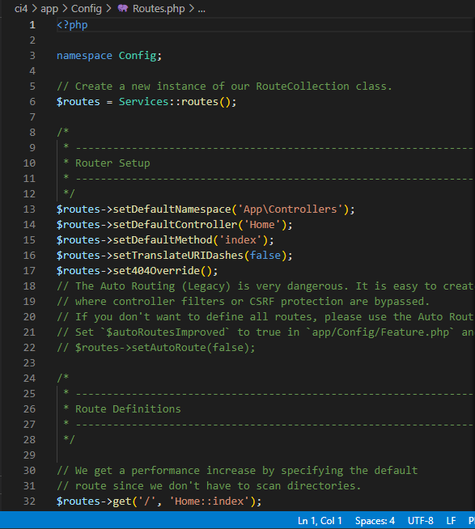
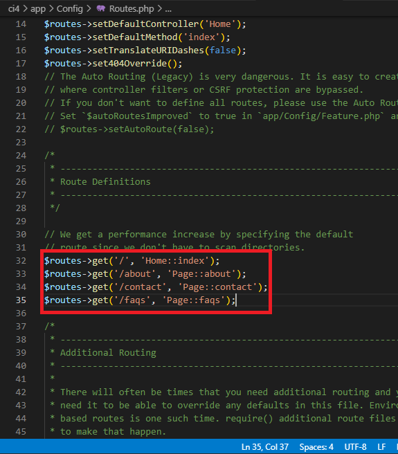
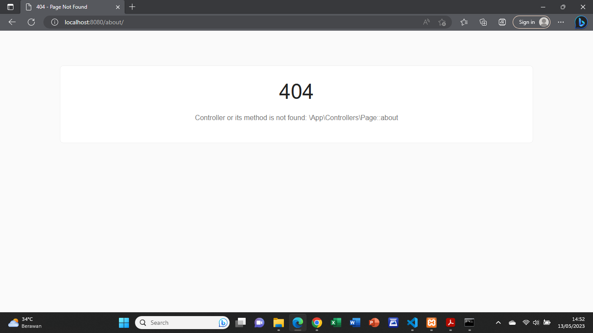
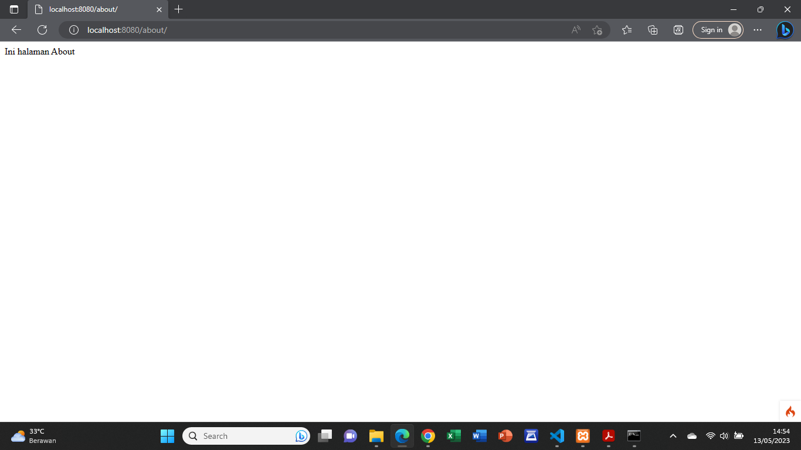
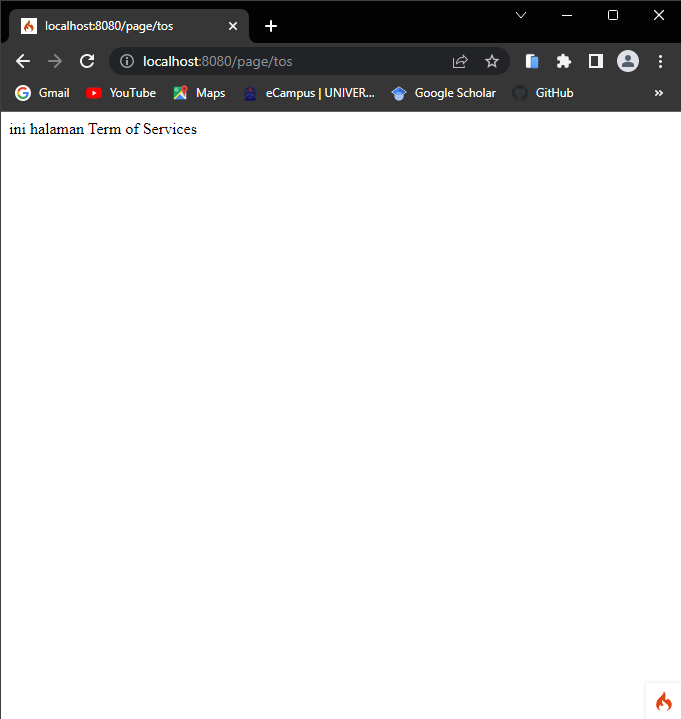
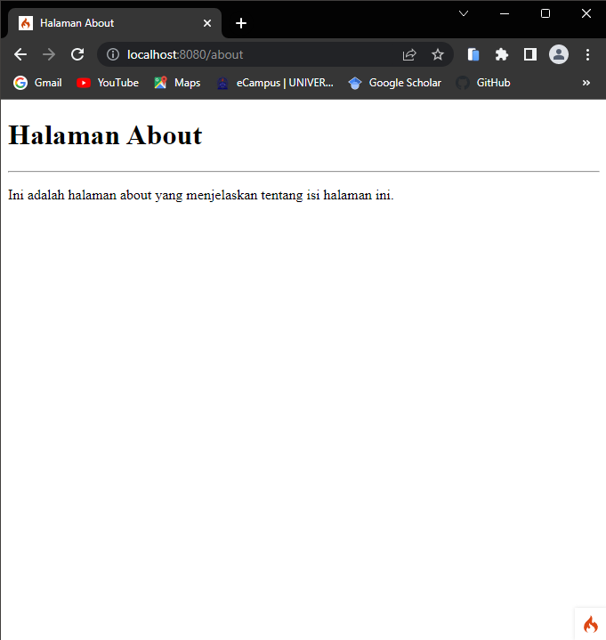
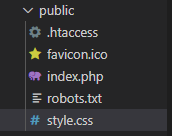
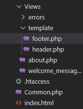
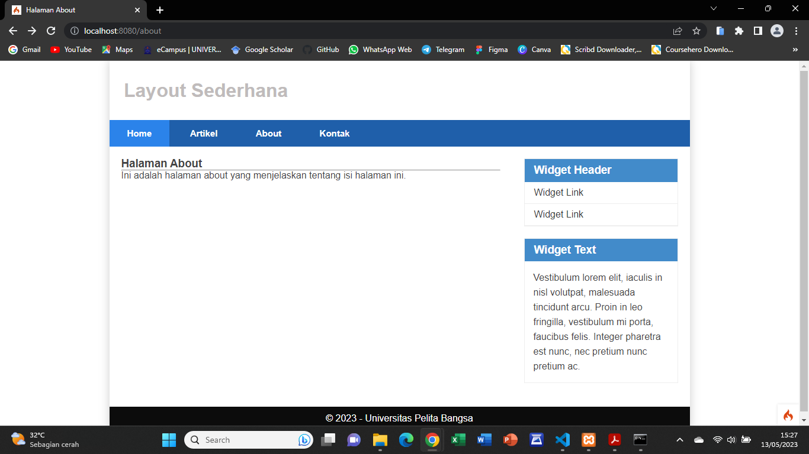
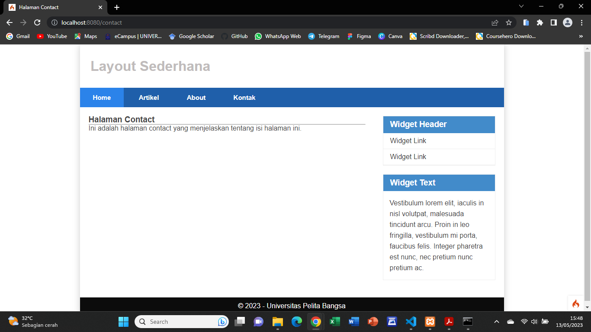

# Praktikum8# Praktikum 7

## A. Routing dan Controller

Routing merupakan proses yang mengatur arah atau rute dari request untuk menentukan fungsi/bagian mana yang akan memproses request tersebut. Pada framework CI 4, routing bertujuan untuk menentukan Controller mana yang harus merespon sebuah request. **Controller adalah class atau script yang bertanggung jawab merespon sebuah request**. Pada Codeigniter, request yang diterima oleh file **index.php** akan diarahkan ke Router untuk kemudian oleh router tesebut diarahkan ke Controller.

* Router terletak pada file **app/config/Routes.php**



* Pada file tersebut kita dapat mendefinisikan route untuk aplikasi yang kita buat.
Contoh :
    `$routes->get('/', 'Home::index');`
(Kode tersebut akan mengarahkan rute untuk halaman home.)

### 1. Membuat Route Baru

* Tambahkan kode berikut di dalam **Routes.php**.
    ```bash
        $routes->get('/about', 'Page::about'); 
        $routes->get('/contact', 'Page::contact'); 
        $routes->get('/faqs', 'Page::faqs');
    ```





Ketika diakses akan mucul tampilan error 404 file not found, itu artinya file/page tersebut tidak ada. Untuk dapat mengakses halaman tersebut, harus dibuat terlebih dahulu Contoller yang sesuai dengan routing yang dibuat yaitu Contoller Page.

### 2. Membuat Controller

* Buat file baru dengan nama **page.php** pada direktori Controller kemudian isi kodenya seperti berikut.

```php
    <?php 
    namespace App\Controllers; 
    class Page extends BaseController 
    { 
        public function about() 
        { 
            echo "Ini halaman About"; 
        } 
        public function contact() 
        { 
            echo "Ini halaman Contact"; 
        } 
        public function faqs() 
        { 
            echo "Ini halaman FAQ"; 
        } 
    }
```

* Selanjutnya refresh Kembali browser, maka akan ditampilkan hasilnya yaitu halaman sudah dapat diakses.




### 3. Auto Routing

* Secara default fitur *autoroute* pada Codeiginiter sudah aktif. Untuk mengubah status autoroute dapat mengubah nilai variabelnya. Untuk menonaktifkan ubah nilai **true** menjadi **false**.

    `$routes->setAutoRoute(true);`

* Tambahkan method baru pada **Controller Page** seperti berikut.

```php
    public function tos() 
    { 
        echo "ini halaman Term of Services"; 
    }
```

* Method ini belum ada pada routing, sehingga cara mengaksesnya dengan menggunakan alamat: http://localhost:8080/page/tos




### 4. Membuat View

* Buat file baru dengan nama **about.php** pada direktori view **(app/view/about.php)** kemudian isi kodenya seperti berikut.

```html
    <!DOCTYPE html> 
    <html lang="en"> 
    <head> 
        <meta charset="UTF-8"> 
        <title><?= $title; ?></title> 
    </head> 
    <body> 
        <h1><?= $title; ?></h1> 
        <hr> 
        <p><?= $content; ?></p> 
    </body> 
    </html>
```

* Ubah **method about** pada class **Controller Page** menjadi seperti berikut:

```php
    public function about() 
    { 
        return view('about', [ 
            'title' => 'Halaman About', 
            'content' => 'Ini adalah halaman about yang menjelaskan tentang isi halaman ini.' 
        ]); 
    }
```

* Kemudian lakukan refresh pada halaman tersebut.




### 5. Membuat Layout Web dengan CSS

Pada dasarnya layout web dengan css dapat diimplamentasikan dengan mudah pada codeigniter. Yang perlu diketahui adalah, pada Codeigniter 4 file yang menyimpan asset css dan javascript terletak pada direktori **public**.

* Buat file css pada direktori **public** dengan nama **style.css**.



* Kemudian buat folder template pada direktori view kemudian buat file **header.php** dan **footer.php**.



* File **app/view/template/header.php**

```html
    <!DOCTYPE html> 
    <html lang="en"> 
    <head> 
        <meta charset="UTF-8"> 
        <title><?= $title; ?></title> 
        <link rel="stylesheet" href="<?= base_url('/style.css');?>"> 
    </head> 
    <body>
        <div id="container"> 
        <header> 
            <h1>Layout Sederhana</h1> 
        </header> 
        <nav> 
            <a href="<?= base_url('/');?>" class="active">Home</a> 
            <a href="<?= base_url('/artikel');?>">Artikel</a> 
            <a href="<?= base_url('/about');?>">About</a> 
            <a href="<?= base_url('/contact');?>">Kontak</a> 
        </nav> 
        <section id="wrapper"> 
            <section id="main">
```

* File **app/view/template/footer.php**

```html
    </section> 
    <aside id="sidebar"> 
        <div class="widget-box"> 
            <h3 class="title">Widget Header</h3> 
            <ul> 
                <li><a href="#">Widget Link</a></li> 
                <li><a href="#">Widget Link</a></li> 
            </ul> 
        </div> 
        <div class="widget-box"> 
            <h3 class="title">Widget Text</h3> 
            <p>Vestibulum lorem elit, iaculis in nisl volutpat, malesuada tincidunt arcu. Proin in leo fringilla, vestibulum mi porta, faucibus felis. Integer pharetra est nunc, nec pretium nunc pretium ac.</p> 
        </div> 
    </aside> 
    </section> 
    <footer> 
        <p>&copy; 2021 - Universitas Pelita Bangsa</p> 
    </footer> 
    </div> 
    </body> 
    </html>
```

* Kemudian ubah file **app/view/about.php** seperti berikut.

```php
    <?= $this->include('template/header'); ?> 
    
    <h1><?= $title; ?></h1> 
    <hr> 
    <p><?= $content; ?></p> 
    
    <?= $this->include('template/footer'); ?>
```

* Selanjutnya refresh tampilan pada alamat http://localhost:8080/about




## Pertanyaan dan Tugas

Lengkapi kode program untuk menu lainnya yang ada pada Controller Page, sehingga semua link pada navigasi header dapat menampilkan tampilan dengan layout yang sama.

## Hasil




## Terimakasih!